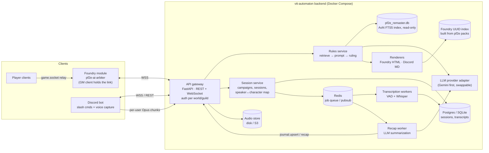

# VTT Automaton — Architecture (draft v0.1)

A single backend that answers Pathfinder 2e (Remaster) rules questions and records and summarizes
game sessions. Foundry VTT and Discord connect to it as thin clients.

> Status: planning. This draft builds on the original "PF2e AI Arbiter" plan (local FastAPI bridge,
> `pf2e_remaster.db` AoN index, `/rule` / `/gmrule` / `/npc` commands). It adds Discord, transcription,
> and fixes for a few problems in that plan (see §8).

---

## 1. Goals

| # | Goal | Notes |
|---|------|-------|
| G1 | **Rules arbiter.** Rulings that quote the RAW text, then interpret it | Rules text is always retrieved from the index, never generated by the model. |
| G2 | **One backend, several front-ends** | Foundry and Discord call the same core, and each formats replies its own way. |
| G3 | **Session transcription** | Discord voice is recorded per speaker, transcribed, and labeled with the speaker's character. |
| G4 | **Session recaps** | The transcript plus Foundry events (rolls, combat) are summarized into a Foundry journal entry and a Discord post. |
| G5 | **Game-state awareness** | Combat context (actor, targets, distances, conditions) and NPC roleplay. |

Out of scope for now: game systems other than PF2e, automatically applying game effects, and live voice replies (TTS).

---

## 2. System overview



**Core principle:** the core services know nothing about Foundry or Discord. They return a neutral
data structure (`Ruling`, `TranscriptSegment`, `Recap`). Per-client *renderers* and *adapters*
convert it to Foundry chat HTML with `@UUID[...]` enrichers, or to a Discord embed with AoN links.

---

## 3. Components

### 3.1 API gateway (FastAPI)
- **REST** for stateless calls (`POST /api/v1/rulings`, `GET /api/v1/sessions/{id}/transcript`).
- **WebSocket** `/ws/foundry` and `/ws/discord` for long-lived client connections, progress
  events ("Consulting the Archives…"), and pushes from the server (recap ready, journal upsert).
- **Auth:** each Foundry world and each Discord guild gets a **client token**, stored hashed. Every
  connection is bound to a `campaign_id`. The backend is never exposed without auth. It sits behind
  Caddy or Traefik for TLS.

### 3.2 Rules service
1. **Parse.** Work out the intent (`rule`, `gmrule`, `npc`, `raw`) and pull out entity names.
2. **Retrieve deterministically.** Search the AoN SQLite index (FTS5 plus exact name/trait match),
   then rank the results. Embeddings can be added later if FTS recall is poor.
3. **Enforce the prompt.** Build a fixed two-section output contract:
   *§1 Verbatim RAW (quoted from the retrieved rows only)*, then *§2 Interpretation for the game state*.
4. **Call the LLM** through the provider adapter and ask for structured output (JSON), not free HTML.
5. **Validate.** Every quote must be a substring of a retrieved row. Every referenced entity must
   resolve in the UUID index. If validation fails, fall back to a "RAW only" response.

Output model (sketch):
```python
class RuleRef(BaseModel):
    kind: Literal["action","condition","spell","feat","trait","rule"]
    name: str
    aon_url: str
    foundry_uuid: str | None      # resolved from the UUID index, never written by the LLM
    raw_text: str                 # verbatim from pf2e_remaster.db

class Ruling(BaseModel):
    query: str
    raw: list[RuleRef]
    interpretation: str           # markdown-ish; renderers convert it
    checks: list[InlineCheck]     # e.g. reflex DC 19 basic -> [[/act ...]] or plain text
    confidence: Literal["high","medium","low"]
```

### 3.3 Renderers
- **Foundry renderer.** Produces chat-card HTML with `@UUID[Compendium.pf2e...]{Name}` links and
  inline checks (`@Check[...]` / `[[/act ...]]`). It uses the PF2e chat-card CSS classes.
- **Discord renderer.** Produces an embed: a RAW block quote, the interpretation, and AoN hyperlinks.
  It stays within Discord's field and character limits.

### 3.4 Foundry UUID index
The AoN DB has no Foundry IDs. A build step reads the compendium packs from the **pf2e system
release** (the JSON sources) and writes a `name/slug → Compendium UUID` table, together with the
pf2e system version it was built from. This avoids the original plan's risk of the LLM making up
`@UUID` IDs.

### 3.5 Session service
- Entities: `Campaign` (1 Foundry world + 1 Discord guild/channel) → `Session` → `Participant`
  (Discord user ↔ Foundry user ↔ PF2e actor).
- A session is started and stopped from either client (`/session start` in Discord, or a GM button
  in Foundry). Both clients see the same session.
- A **timeline** stores `TranscriptSegment`s *and* `GameEvent`s (Foundry chat rolls, combat
  start and end, round changes) on a single clock. This combined timeline is what makes useful
  recaps possible.

### 3.6 Transcription pipeline
1. **Capture.** The Discord bot joins the voice channel and receives a **separate Opus stream per
   user**. This gives speaker labels without a diarization model.
2. **Ingest.** The bot cuts audio into chunks of about 10–30 s at silence boundaries and uploads
   them with `(session_id, discord_user_id, t_start)`. Raw audio goes to the audio store.
3. **Transcribe.** A worker (`faster-whisper` on GPU locally, or a hosted STT API, configurable)
   takes chunk jobs from Redis and writes the resulting segments.
4. **Live view** (optional). Segments are pushed over the WebSocket as they finish (a "captions"
   panel in Foundry).
5. **Retention.** Audio is deleted N days after the recap is approved. The transcript is kept.

**Consent:** the bot announces that it is recording when it joins, and posts a pinned notice.
Players can opt out per campaign, and their audio is then dropped at capture.

### 3.7 Recap worker
After a session stops, the worker splits the timeline into scenes or encounters and summarizes each
one, then rolls those up into one recap. It also extracts NPCs, loot, quests, and open threads. The
recap is pushed as `journal.upsert` (the Foundry GM client creates or updates a JournalEntry) and
as a Discord post. The GM can review it before it is published.

### 3.8 LLM provider adapter
A small interface: `complete(messages, schema) -> obj` and `embed(texts)`. Gemini is the first
implementation. (Note: "Antigravity" is Google's IDE, not an API; the backend calls the Gemini API
directly.) Keeping the adapter swappable makes it easy to compare models on the rules-eval set.

---

## 4. Client adapters

### 4.1 Foundry module (`foundry-module/pf2e-ai-arbiter`)
- **Only the active GM client keeps the backend connection** (`game.users.activeGM`).
  Player commands go to it through `game.socket` (manifest `"socket": true`). The GM client calls
  the backend and creates the `ChatMessage` with the configured speaker alias and whisper targets.
- Intercepts `/rule`, `/gmrule`, `/npc` in `Hooks.on("chatMessage")`, which returns `false`.
- Shows a temporary "Consulting the Archives…" message and replaces it when the result arrives.
- Collects context (controlled token, targets, distances, conditions) on the calling client and
  sends it along with the query.
- Sends `GameEvent`s (rolls, combat updates) when a session is active.
- Settings: backend URL, client token (world setting, GM only), speaker name and avatar.

### 4.2 Discord bot (`discord-bot/`)
- Slash commands: `/rule`, `/gmrule` (ephemeral), `/session start|stop|status`, `/recap`, `/link`
  (map a Discord user to a Foundry actor).
- Voice capture as described in §3.6.
- **Risk to check before choosing a library:** Discord's voice E2EE (DAVE) affects whether bots can
  receive audio. Check which library currently supports *receiving* voice under DAVE
  (`@discordjs/voice` vs. py-cord / `discord-ext-voice-recv`). If only the Node library does,
  the bot is a small Node service. It is a thin adapter either way, so this does not affect the
  backend.

---

## 5. Protocol (WebSocket, JSON envelopes)

```jsonc
// client → server
{ "type": "ruling.request", "id": "c1", "mode": "public|gm|npc",
  "query": "Can I reach the archer?",
  "user": { "foundryId": "...", "name": "...", "isGM": false },
  "context": { "sceneId": "...", "actor": {...}, "targets": [...], "distances": {...} } }
{ "type": "session.event", "sessionId": "...", "event": { "kind": "roll", "t": 1730000000.12, ... } }

// server → client
{ "type": "ruling.pending", "id": "c1" }
{ "type": "ruling.result",  "id": "c1", "html": "...", "ruling": { /* neutral model */ } }
{ "type": "journal.upsert", "sessionId": "...", "name": "Session 12 — ...", "html": "..." }
{ "type": "error", "id": "c1", "code": "rules.no_match", "message": "..." }
```
The protocol is versioned (`"v": 1`) so the module and backend can be released separately.

---

## 6. Repository layout (monorepo)

```
vtt-automaton/
├─ backend/                 Python 3.12, FastAPI, uv, pydantic
│  ├─ app/api/              http + websocket routers, auth
│  ├─ app/rules/            retrieval, prompt contract, validation
│  ├─ app/sessions/         campaign/session/participant, timeline
│  ├─ app/transcription/    ingest, chunk jobs, STT providers
│  ├─ app/recap/            summarization pipeline
│  ├─ app/render/           foundry.py, discord.py
│  ├─ app/llm/              provider interface + gemini
│  ├─ tools/build_uuid_index.py
│  └─ tests/                incl. rules eval set (golden Q→A)
├─ discord-bot/
├─ foundry-module/pf2e-ai-arbiter/
├─ docs/
└─ compose.yaml             backend, worker, discord-bot, redis, (postgres)
```

---

## 7. Roadmap

| Phase | Milestone | Done when |
|-------|-----------|-----------|
| 0 | Skeleton | Monorepo, compose, CI (lint + tests), config/secrets layout |
| 1 | Rules core MVP | `POST /rulings` returns a validated `Ruling` from the AoN DB + Gemini; `curl` and pytest eval set pass |
| 2 | Foundry module MVP | `/rule` and `/gmrule` work from player clients through the GM relay; pending message; UUID links resolve |
| 3 | Discord rules | `/rule` in Discord, served by the same core |
| 4 | Session capture | `/session start` records per-user audio → transcripts in DB, with a speaker↔actor map |
| 5 | Recaps | Combined timeline → recap JournalEntry + Discord post, after GM review |
| 6 | Game-state depth | Combat context in rulings, `/npc` roleplay from stat blocks, live captions |

---

## 8. Changes from the original Arbiter plan

1. **`fetch("http://127.0.0.1:8765")` from the module only works for whoever is sitting at the host
   machine.** Every other player's browser would try to connect to *its own* localhost. If Foundry
   is served over HTTPS, browsers also block the plain-HTTP call as mixed content. → Relay through
   the GM client over WSS to an authenticated backend (§4.1).
2. **The LLM must not write Foundry UUIDs.** They come from the UUID index (§3.4).
3. **"Verbatim RAW" is checked by code** (substring validation), not left to the prompt.
4. **Version pins.** `compatibility.verified: "12"` and `pf2e >= 5.0.0` are out of date. Target the
   current Foundry major and pf2e system release, and record the pf2e version in the UUID index.
5. **A local daemon is replaced by a deployable service.** It still runs on a home box via compose,
   but Discord and remote players need it reachable.

---

## 9. Open decisions

- [ ] Discord bot language (depends on DAVE voice-receive support, §4.2).
- [ ] STT: local `faster-whisper` (GPU available?) vs. hosted API.
- [ ] Hosting: home server vs. VPS, and how Foundry is hosted (self-hosted / Forge / Molten).
- [ ] Storage: SQLite for v1 vs. Postgres from day one.
- [ ] Recap review flow: auto-publish vs. GM approval.
- [ ] Source and license of `pf2e_remaster.db` / `pf2e-lookup`: is it already a repo we can vendor in?
