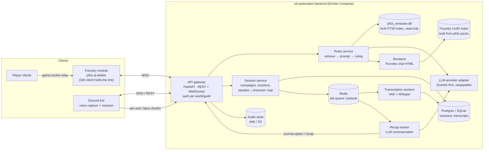

# VTT Automaton — Architecture (draft v0.2)

A single backend that answers Pathfinder 2e (Remaster) rules questions and records and summarizes
game sessions. Two thin clients connect to it: the **Foundry module** is the rules assistant, and the
**Discord bot** transcribes sessions.

> Status: planning. This draft builds on the original "PF2e AI Arbiter" plan (local FastAPI bridge,
> `pf2e_remaster.db` AoN index, `/rule` / `/gmrule` / `/npc` commands). It adds Discord transcription
> and fixes for a few problems in that plan (see §8).

---

## 1. Goals

| # | Goal | Notes |
|---|------|-------|
| G1 | **Rules arbiter in Foundry.** Print the full rules as written (RAW) first, then a ruling for the situation | Remaster rules only; legacy rules are disregarded. Rules text is always retrieved from the index, never generated by the model. |
| G2 | **One backend, two clients with separate jobs** | Foundry: rules. Discord: voice capture for transcription. |
| G3 | **Session transcription** | Discord voice is recorded per speaker, transcribed, and labeled with the speaker's character. |
| G4 | **Session recaps** | The transcript plus Foundry events (rolls, combat) are summarized into a Foundry journal entry. |
| G5 | **Game-state awareness** | Combat context (actor, targets, distances, conditions) and NPC roleplay. |

Out of scope for now: game systems other than PF2e, automatically applying game effects, and live voice replies (TTS).

---

## 2. System overview



**Core principle:** the core services know nothing about Foundry or Discord. They return a neutral
data structure (`Ruling`, `TranscriptSegment`, `Recap`). Per-client *renderers* and *adapters*
convert it to Foundry chat HTML with `@UUID[...]` enrichers.

---

## 3. Components

### 3.1 API gateway (FastAPI)
- **REST** for stateless calls (`POST /api/v1/rulings`, `GET /api/v1/sessions/{id}/transcript`).
- **WebSocket** `/ws/foundry` and `/ws/discord` for long-lived client connections, progress
  events ("Consulting the Archives…"), and pushes from the server (recap ready, journal upsert).
- **Auth:** each Foundry world and each Discord guild gets a **client token**, stored hashed. Every
  connection is bound to a `campaign_id`. The backend is never exposed without auth. It sits behind
  Caddy or Traefik for TLS.

### 3.2 Rules service
1. **Analyse the query (LLM).** The table asks in Finnish with English game terms mixed in, but
   the rules DB is English. A small LLM call returns the official English Remaster names of the
   rules elements involved plus an English translation of the question. If that call fails, the
   words of the query itself are used as search terms.
2. **Retrieve deterministically.** Exact name matches first, then SQLite FTS5 matches ranked by
   bm25, with rule categories (actions, conditions, rules, spells, feats, traits…) ahead of
   items, creatures and hazards. Up to 8 entries; in the prompt each is cut at 4,000 characters
   (whole classes run to 15,000+).
3. **Enforce the prompt.** Build a fixed two-section output contract:
   *§1 the full RAW text of every cited entry (from the DB, in English)*, then *§2 the ruling for
   the situation, in Finnish, keeping official English term names*. The LLM only chooses which
   entries to cite and quotes the deciding passage; the RAW printed in chat comes from the DB.
   The prompts state that the table plays Remaster only and map legacy terms to Remaster ones.
4. **Call the LLM** through the provider adapter and ask for structured output (JSON), not free HTML.
5. **Validate.** Every quote must be a substring of a retrieved row. Every referenced entity must
   resolve in the UUID index. If validation fails, fall back to a "RAW only" response.

Output model (sketch):
```python
class RuleRef(BaseModel):
    kind: Literal["action","condition","spell","feat","trait","rule"]
    name: str
    aon_url: str
    foundry_uuid: str | None      # resolved from the UUID index, never written by the LLM
    raw_text: str                 # verbatim from pf2e_remaster.db

class Ruling(BaseModel):
    query: str
    raw: list[RuleRef]
    interpretation: str           # markdown-ish; renderers convert it
    checks: list[InlineCheck]     # e.g. reflex DC 19 basic -> [[/act ...]] or plain text
    confidence: Literal["high","medium","low"]
```

### 3.3 Renderer (Foundry only)
- **Foundry renderer.** Produces chat-card HTML with `@UUID[Compendium.pf2e...]{Name}` links and
  inline checks (`@Check[...]` / `[[/act ...]]`). It uses the PF2e chat-card CSS classes.
- Layout: "Säännöt (RAW)" with the text of each cited entry, then "Tulkinta" with the ruling
  and a confidence label.
- **Length budget: RAW + ruling ≤ 3000 characters** (`VTT_MAX_RULING_CHARS`). The LLM is asked
  for at most 3 citations and a ruling of about 600 characters; the ruling is hard-capped at
  1000 characters on a sentence boundary. Cited entries are shown whole while they fit (a typical
  action or condition is 400–600 characters). An entry that doesn't fit (e.g. a long rules
  section or a class) shows only its verified cited passage, with a link to the full rule on AoN.

### 3.4 Foundry UUID index
The AoN DB has no Foundry IDs. A build step reads the compendium packs from the **pf2e system
release** (the JSON sources) and writes a `name/slug → Compendium UUID` table, together with the
pf2e system version it was built from. This avoids the original plan's risk of the LLM making up
`@UUID` IDs.

### 3.5 Session service
- Entities: `Campaign` (1 Foundry world + 1 Discord guild/channel) → `Session` → `Participant`
  (Discord user ↔ Foundry user ↔ PF2e actor).
- A session is started and stopped from either client (`/session start` in Discord, or a GM button
  in Foundry). Both clients see the same session.
- A **timeline** stores `TranscriptSegment`s *and* `GameEvent`s (Foundry chat rolls, combat
  start and end, round changes) on a single clock. This combined timeline is what makes useful
  recaps possible.

### 3.6 Transcription pipeline (built)
```
Discord voice ─▶ discord-bot ──WAV per utterance──▶ stt-worker (GPU) ──text──▶ backend
                 (Node)          POST /v1/utterances  faster-whisper   POST /api/v1/transcript/segments
                                                                        ├─ stored in sessions.db
                                                                        └─ "Nethys, …" → Foundry
```
1. **Capture** (`discord-bot/src/recorder.ts`). The bot joins undeafened and gets a **separate
   Opus stream per user** from `@discordjs/voice` 0.19 (DAVE end-to-end encryption is handled by
   `@snazzah/davey`). This gives speaker labels without a diarization model.
2. **Cut.** Each stream ends after 800 ms of silence (Discord's own speaking detection). The Opus
   is decoded straight to 48 kHz mono PCM (libopus downmixes) and sent as a WAV clip with
   `(session_id, speaker, speaker_id, character, t_start)`. Speech longer than 30 s is sent in
   30 s pieces; clips under 0.4 s (coughs, clicks) are dropped. **No audio is stored** anywhere:
   clips exist only in memory until transcribed.
3. **Transcribe** (`stt-worker/`). One `faster-whisper` model on the GPU, fed by an in-memory
   queue. **Finnish with English game terms** is the hard case:
   - `language="fi"` is forced (auto-detect flips between fi/en on short clips).
   - An `initial_prompt` lists the table's vocabulary (`STT_PROMPT_TERMS`: wake word, character
     and place names, English PF2e terms).
   - `large-v3` by default (not `turbo`, which is weaker on lower-resource languages). Compare it
     with Finnish fine-tuned checkpoints on a **hand-corrected 10–15 min sample of a real
     session** before settling.
   - Whisper hallucinations are dropped: subtitle credits ("Kiitos katsomisesta",
     "Tekstitys: …"), echoes of the prompt on noise (seen in testing), and pieces with high
     no-speech probability and low confidence.
4. **Store and react** (backend). Segments are stored per session in `data/sessions.db` (late
   segments after `/session stop` are kept) and go through the voice-ruling detector (§4.3).
5. **Transcript.** On `/session stop` the bot posts the transcript as a text file in the channel
   (`[h:mm:ss] Speaker (Character): text`); `/session transcript` posts the latest again.
   API: `GET /api/v1/sessions/{id}/transcript?format=text`.

**Consent:** `/session start` posts a notice that recording started, that no audio is stored, and
how to opt out. `/optout` takes effect immediately; that user's audio is never subscribed to.
Recording stops by itself when the voice channel has been empty for 5 minutes.

### 3.7 Recap worker
Recaps are written in Finnish. After a session stops, the worker splits the timeline into scenes or encounters and summarizes each
one, then rolls those up into one recap. It also extracts NPCs, loot, quests, and open threads. The
recap is pushed as `journal.upsert` (the Foundry GM client creates or updates a JournalEntry).
The GM can review it before it is published.

### 3.8 LLM provider adapter
A small interface: `complete(messages, schema) -> obj` and `embed(texts)`. Gemini is the first
implementation. (Note: "Antigravity" is Google's IDE, not an API; the backend calls the Gemini API
directly.) Keeping the adapter swappable makes it easy to compare models on the rules-eval set.

### 3.9 Rules import (`backend/app/ingest/`)
- Source: the public Elasticsearch index behind the AoN site search
  (`elasticsearch.aonprd.com/aon`), paged with `search_after`, 500 docs per request with a short
  pause between pages. A full import takes about a minute.
- Kept: the current version of each entry. Skipped: legacy entries that have a `remaster_id`
  (superseded), `exclude_from_search` sub-entries (item activations), and navigation/source pages.
  AoN has no legacy flag and doesn't link every legacy entry (e.g. Attack of Opportunity →
  Reactive Strike). So entries whose sources are *all* pre-Remaster books that a Remaster edition
  replaced (Core Rulebook, APG, GMG, Bestiary 1–3, and the non-remastered Treasure Vault,
  Guns & Gears, Dark Archive) are stored with `legacy = 1` and never used for rulings (~1,400
  entries). They stay in the DB for possible later use (e.g. creatures in older APs). Older books
  with no Remaster edition (Secrets of Magic, Book of the Dead…) count as current.
- AoN markdown is converted to plain text for quoting. The original markdown is not stored
  (it would double the DB size); re-add it when compendium links need it.
- The DB is written to a temp file and swapped in atomically, so requests never see a partial
  import, and a failed import keeps the old DB. The AoN index name is stored in `meta`; the
  periodic refresh (default every 24 h) costs one small query unless AoN has rebuilt.

---

## 4. Client adapters

### 4.1 Foundry module (`foundry-module/pf2e-ai-arbiter`)
- **Only the active GM's browser keeps the backend connection** (`game.users.activeGM`), a
  WebSocket to `wss://<backend>/ws/foundry` through the Cloudflare tunnel. It is two-way, so the
  backend can also push voice-asked rulings (§4.3). Auth is a `hello` message with the client
  token; the backend also checks the page origin (the Molten world URL). Keep-alive ping every
  25 s (Cloudflare drops idle sockets after ~100 s); reconnects with backoff.
- `/rule <question>` (public) and `/gmrule <question>` (whispered to GMs) are intercepted in
  `Hooks.on("chatMessage")`. Players' commands reach the GM's browser through the module socket
  (`"socket": true`). The GM's browser creates every chat card, so whispers and permissions are
  handled in one place: a "Selataan arkistoja…" card first, updated in place with the result.
- Context sent with chat questions: the asker's controlled token (or character) and targets.
- Settings: backend URL (world), client token (**client scope**: stored only in the GM's browser,
  never synced to players), speaker name, and an on/off switch for voice rulings.
- Released by tagging `module-vX.Y.Z`; CI publishes `module.json` + zip to GitHub releases, and
  Molten installs it from the manifest URL.
- Later: `GameEvent`s (rolls, combat) for the session timeline, `@UUID` links, `/npc`.

### 4.2 Discord bot (`discord-bot/`, TypeScript, discord.js 14 + @discordjs/voice 0.19)
- Job: **transcription only**. No rules commands; rulings live in Foundry.
- Slash commands (registered to one server, `DISCORD_GUILD_ID`): `/session start [label]`,
  `/session stop`, `/session status`, `/session transcript`, `/link character:<name>` (shown next
  to the speaker in transcripts and in voice-ruling context), `/optout`, `/optin`. Replies are in
  Finnish.
- Intents: `Guilds` and `GuildVoiceStates` only (no privileged intents). Needs the Connect
  permission in the voice channel.
- Reconnects after short voice drops; posts a notice and stops if the connection is lost.
- Character names and opt-outs are kept in `data/discord-bot/users.json`.
- **Still to verify live:** receiving audio in a real DAVE-encrypted call. The library supports
  it (it decrypts per user with `@snazzah/davey`), but it has only been tested with recorded
  Opus here.

---

### 4.3 Voice-asked rulings (transcript → Foundry)
Saves typing: a rules question asked out loud at the table is answered in Foundry chat.
- **Trigger:** the wake word (default "Nethys", `VTT_WAKE_WORDS`) anywhere in a transcript
  segment; the rest of the segment is the question. Fuzzy matching tolerates STT spelling
  ("Nethis") and Finnish endings ("Nethysiltä") without firing on ordinary words ("netissä").
  If only the wake word is heard, the same speaker's next segment within 8 s is the question.
- **Secret:** "Nethys, salaa …" → GM-only ruling (whispered), like `/gmrule`.
- **Context:** the last 90 s of table talk (all speakers) goes to the LLM as situation context,
  marked as speech-to-text that may contain errors. Rules text still comes only from the DB.
- **Visible:** the card header shows "🎙 Kuultu: <speaker>: <what was heard>", so a misheard
  question is obvious at once. The same question within 30 s is ignored (two people repeating
  it); nothing is sent to the LLM when no Foundry GM client is connected.
- **Entry point:** `POST /api/v1/transcript/segments {speaker, text, t}`. The transcription
  worker (phase 3) calls the same service in-process; until then the endpoint can be used to
  test by hand. Latency budget: segment end → STT (~1–2 s on GPU) → ruling (~3–6 s).

## 5. Protocol (Foundry WebSocket, JSON, version 1)

```jsonc
// client → server
{ "type": "hello", "v": 1, "token": "..." }                       // first message
{ "type": "ruling.request", "id": "c1",
  "request": { "query": "...", "mode": "public|gm", "user": "Aino", "render": "foundry",
               "context": { "actor": "Valeros", "targets": ["Orc"] } } }
{ "type": "ping" }

// server → client
{ "type": "welcome", "v": 1 }
{ "type": "ruling.pending", "id": "c1", "origin": "chat" }
{ "type": "ruling.pending", "id": "voice-…", "origin": "voice",
  "speaker": "Aino", "query": "...", "mode": "public" }             // server-initiated
{ "type": "ruling.result", "id": "…", "origin": "chat|voice", "html": "...", "ruling": {...} }
{ "type": "ruling.error",  "id": "…", "origin": "chat|voice", "code": "rules.no_match", "message": "..." }
{ "type": "pong" }
// later: { "type": "journal.upsert", ... } for recaps; client "session.event" for game events
```

---

## 6. Repository layout (monorepo)

```
vtt-automaton/
├─ backend/                 Python 3.12, FastAPI, uv, pydantic
│  ├─ app/api/              http + websocket routers, auth
│  ├─ app/rules/            retrieval, prompt contract, validation
│  ├─ app/sessions/         campaign/session/participant, timeline
│  ├─ app/transcription/    ingest, chunk jobs, STT providers
│  ├─ app/recap/            summarization pipeline
│  ├─ app/render/           foundry.py
│  ├─ app/llm/              provider interface + gemini
│  ├─ tools/build_uuid_index.py
│  └─ tests/                incl. rules eval set (golden Q→A)
├─ discord-bot/
├─ foundry-module/pf2e-ai-arbiter/
├─ docs/
└─ compose.yaml             backend, worker, discord-bot, redis, (postgres)
```

---

## 7. Roadmap

| Phase | Milestone | Done when |
|-------|-----------|-----------|
| 0 ✅ | Skeleton | Monorepo, compose, CI (lint + tests), config/secrets layout |
| 1 ✅ | Rules core MVP | `POST /rulings` returns a validated `Ruling` from the AoN DB + Gemini; `curl` and pytest eval set pass |
| 2 ✅ | Foundry module MVP | `/rule` and `/gmrule` work from player clients through the GM relay; pending message; voice-asked rulings via the transcript endpoint |
| 3 🚧 | Session capture | `/session start` records per-user audio → transcripts in DB, with a speaker↔actor map; live segments feed voice rulings |
| 4 | Recaps | Combined timeline → recap JournalEntry, after GM review |
| 5 | Game-state depth | Combat context in rulings, `/npc` roleplay from stat blocks, live captions |

---

## 8. Changes from the original Arbiter plan

1. **`fetch("http://127.0.0.1:8765")` from the module only works for whoever is sitting at the host
   machine.** Every other player's browser would try to connect to *its own* localhost. If Foundry
   is served over HTTPS, browsers also block the plain-HTTP call as mixed content. → Relay through
   the GM client over WSS to an authenticated backend (§4.1).
2. **The LLM must not write Foundry UUIDs.** They come from the UUID index (§3.4).
3. **"Verbatim RAW" is checked by code** (substring validation), not left to the prompt.
4. **Version pins.** `compatibility.verified: "12"` and `pf2e >= 5.0.0` are out of date. Target the
   current Foundry major and pf2e system release, and record the pf2e version in the UUID index.
5. **A local daemon is replaced by a deployable service.** It still runs on a home box via compose,
   but Discord and remote players need it reachable.

---

## 9. Decisions

| Topic | Decision |
|-------|----------|
| Backend hosting | Home server, Docker Compose |
| STT | Local `faster-whisper` on the home server GPU (§3.6) |
| Foundry | Hosted on Molten (Foundry server is not ours; only the module runs our code) |
| Rules data | Local SQLite DB imported from Archives of Nethys by the backend itself (§3.9) |
| Discord bot | Transcription only; Node / TypeScript |
| Rules output | Foundry only: full RAW first, then the ruling; Remaster only, legacy disregarded |
| Language | Table speaks Finnish with English game terms; RAW is quoted in English, interpretations and recaps are Finnish |
| Backend language | Python 3.11+, FastAPI, uv |

Still open:
- [ ] Storage: SQLite for v1 vs. Postgres from day one (leaning SQLite until phase 4).
- [ ] Recap review flow: auto-publish vs. GM approval (leaning GM approval).

---

## 10. Networking: Molten-hosted Foundry ↔ home-server backend

Foundry pages are served over HTTPS from Molten, so the GM's browser can only connect to the
backend over **HTTPS/WSS with a valid certificate** (plain `http://` or `ws://` is blocked as
mixed content). The backend listens on `127.0.0.1:8765` and is published through a tunnel:

| Option | How | Trade-off |
|--------|-----|-----------|
| **Cloudflare Tunnel** (chosen) | `cloudflared` container → `https://arbiter.ttrpg-arbiter.org` | No open ports, works from any GM device; needs a domain on Cloudflare. Endpoint is public, protected by client token + CORS. |
| Tailscale Serve | `tailscale serve` → `https://<host>.<tailnet>.ts.net` | Not reachable from the internet at all, but the GM's machine must be on the tailnet. Works because only the GM client connects. |
| Port forward + Caddy | Router forward 443 → Caddy with Let's Encrypt | Most moving parts; exposes the home IP. |

`cloudflared` runs as a compose service; the tunnel's public hostname points at
`http://backend:8765`. The Discord bot runs on the same home server and only makes outbound connections.
CORS allows only the Molten world's origin (`VTT_CORS_ORIGINS`). The Foundry module is installed
on Molten from a manifest URL served by GitHub releases.
