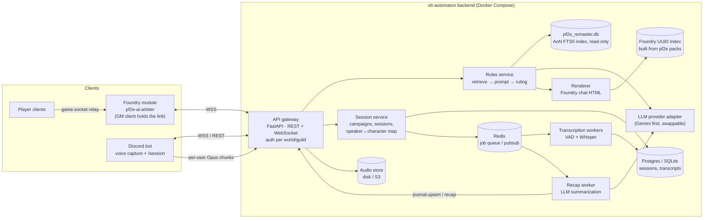

# VTT Automaton — Architecture (draft v0.2)

A single backend that answers Pathfinder 2e (Remaster) rules questions and records and summarizes
game sessions. Two thin clients connect to it: the **Foundry module** is the rules assistant, and the
**Discord bot** transcribes sessions.

> Status: planning. This draft builds on the original "PF2e AI Arbiter" plan (local FastAPI bridge,
> `pf2e_remaster.db` AoN index, `/rule` / `/gmrule` / `/npc` commands). It adds Discord transcription
> and fixes for a few problems in that plan (see §8).

---

## 1. Goals

| # | Goal | Notes |
|---|------|-------|
| G1 | **Rules arbiter in Foundry.** Print the full rules as written (RAW) first, then a ruling for the situation | Remaster rules only; legacy rules are disregarded. Rules text is always retrieved from the index, never generated by the model. |
| G2 | **One backend, two clients with separate jobs** | Foundry: rules. Discord: voice capture for transcription. |
| G3 | **Session transcription** | Discord voice is recorded per speaker, transcribed, and labeled with the speaker's character. |
| G4 | **Session recaps** | The transcript plus Foundry events (rolls, combat) are summarized into a Foundry journal entry. |
| G5 | **Game-state awareness** | Combat context (actor, targets, distances, conditions) and NPC roleplay. |

Out of scope for now: game systems other than PF2e, automatically applying game effects, and live voice replies (TTS).

---

## 2. System overview



**Core principle:** the core services know nothing about Foundry or Discord. They return a neutral
data structure (`Ruling`, `TranscriptSegment`, `Recap`). Per-client *renderers* and *adapters*
convert it to Foundry chat HTML with `@UUID[...]` enrichers.

---

## 3. Components

### 3.1 API gateway (FastAPI)
- **REST** for stateless calls (`POST /api/v1/rulings`, `GET /api/v1/sessions/{id}/transcript`).
- **WebSocket** `/ws/foundry` and `/ws/discord` for long-lived client connections, progress
  events ("Consulting the Archives…"), and pushes from the server (recap ready, journal upsert).
- **Auth:** each Foundry world and each Discord guild gets a **client token**, stored hashed. Every
  connection is bound to a `campaign_id`. The backend is never exposed without auth. It sits behind
  Caddy or Traefik for TLS.

### 3.2 Rules service
1. **Analyse the query (LLM).** The table asks in Finnish with English game terms mixed in, but
   the rules DB is English. A small LLM call returns the official English Remaster names of the
   rules elements involved plus an English translation of the question. If that call fails, the
   words of the query itself are used as search terms.
2. **Retrieve deterministically.** Search the AoN SQLite index (FTS5 plus exact name/trait match),
   then rank the results. Embeddings can be added later if FTS recall is poor.
3. **Enforce the prompt.** Build a fixed two-section output contract:
   *§1 the full RAW text of every cited entry (from the DB, in English)*, then *§2 the ruling for
   the situation, in Finnish, keeping official English term names*. The LLM only chooses which
   entries to cite and quotes the deciding passage; the RAW printed in chat comes from the DB.
   The prompts state that the table plays Remaster only and map legacy terms to Remaster ones.
4. **Call the LLM** through the provider adapter and ask for structured output (JSON), not free HTML.
5. **Validate.** Every quote must be a substring of a retrieved row. Every referenced entity must
   resolve in the UUID index. If validation fails, fall back to a "RAW only" response.

Output model (sketch):
```python
class RuleRef(BaseModel):
    kind: Literal["action","condition","spell","feat","trait","rule"]
    name: str
    aon_url: str
    foundry_uuid: str | None      # resolved from the UUID index, never written by the LLM
    raw_text: str                 # verbatim from pf2e_remaster.db

class Ruling(BaseModel):
    query: str
    raw: list[RuleRef]
    interpretation: str           # markdown-ish; renderers convert it
    checks: list[InlineCheck]     # e.g. reflex DC 19 basic -> [[/act ...]] or plain text
    confidence: Literal["high","medium","low"]
```

### 3.3 Renderer (Foundry only)
- **Foundry renderer.** Produces chat-card HTML with `@UUID[Compendium.pf2e...]{Name}` links and
  inline checks (`@Check[...]` / `[[/act ...]]`). It uses the PF2e chat-card CSS classes.
- Layout: "Säännöt (RAW)" with the **full** text of each cited entry, then "Tulkinta" with the
  ruling and a confidence label. Nothing is clipped. Entries over ~1500 characters (whole rules
  sections) start collapsed in a `<details>` block so they don't flood the chat log.

### 3.4 Foundry UUID index
The AoN DB has no Foundry IDs. A build step reads the compendium packs from the **pf2e system
release** (the JSON sources) and writes a `name/slug → Compendium UUID` table, together with the
pf2e system version it was built from. This avoids the original plan's risk of the LLM making up
`@UUID` IDs.

### 3.5 Session service
- Entities: `Campaign` (1 Foundry world + 1 Discord guild/channel) → `Session` → `Participant`
  (Discord user ↔ Foundry user ↔ PF2e actor).
- A session is started and stopped from either client (`/session start` in Discord, or a GM button
  in Foundry). Both clients see the same session.
- A **timeline** stores `TranscriptSegment`s *and* `GameEvent`s (Foundry chat rolls, combat
  start and end, round changes) on a single clock. This combined timeline is what makes useful
  recaps possible.

### 3.6 Transcription pipeline
1. **Capture.** The Discord bot joins the voice channel and receives a **separate Opus stream per
   user**. This gives speaker labels without a diarization model.
2. **Ingest.** The bot cuts audio into chunks of about 10–30 s at silence boundaries and uploads
   them with `(session_id, discord_user_id, t_start)`. Raw audio goes to the audio store.
3. **Transcribe.** A GPU worker on the home server runs `faster-whisper` and takes chunk jobs
   from Redis. **Finnish with English game terms** is the hard case:
   - Force `language="fi"` (auto-detect flips between fi/en on short chunks).
   - Pass an `initial_prompt` / hotword list per campaign: PC and NPC names, place names and the
     English PF2e terms the table uses (Strike, off-guard, Trip, Shield Block…).
   - Start with `large-v3` (not `turbo`, which is weaker on lower-resource languages) and compare
     it with Finnish fine-tuned Whisper checkpoints on a **hand-corrected 10–15 min sample of a
     real session** (measure WER) before committing.
   - A cleanup pass after the session (LLM, with the campaign glossary) fixes misheard names
     before summarizing; the raw transcript is kept alongside.
4. **Live view** (optional). Segments are pushed over the WebSocket as they finish (a "captions"
   panel in Foundry).
5. **Retention.** Audio is deleted N days after the recap is approved. The transcript is kept.

**Consent:** the bot announces that it is recording when it joins, and posts a pinned notice.
Players can opt out per campaign, and their audio is then dropped at capture.

### 3.7 Recap worker
Recaps are written in Finnish. After a session stops, the worker splits the timeline into scenes or encounters and summarizes each
one, then rolls those up into one recap. It also extracts NPCs, loot, quests, and open threads. The
recap is pushed as `journal.upsert` (the Foundry GM client creates or updates a JournalEntry).
The GM can review it before it is published.

### 3.8 LLM provider adapter
A small interface: `complete(messages, schema) -> obj` and `embed(texts)`. Gemini is the first
implementation. (Note: "Antigravity" is Google's IDE, not an API; the backend calls the Gemini API
directly.) Keeping the adapter swappable makes it easy to compare models on the rules-eval set.

### 3.9 Rules import (`backend/app/ingest/`)
- Source: the public Elasticsearch index behind the AoN site search
  (`elasticsearch.aonprd.com/aon`), paged with `search_after`, 500 docs per request with a short
  pause between pages. A full import takes about a minute.
- Kept: the current version of each entry. Skipped: legacy entries that have a `remaster_id`
  (superseded), `exclude_from_search` sub-entries (item activations), and navigation/source pages.
  AoN has no legacy flag and doesn't link every legacy entry (e.g. Attack of Opportunity →
  Reactive Strike). So entries whose sources are *all* pre-Remaster books that a Remaster edition
  replaced (Core Rulebook, APG, GMG, Bestiary 1–3, and the non-remastered Treasure Vault,
  Guns & Gears, Dark Archive) are stored with `legacy = 1` and never used for rulings (~1,400
  entries). They stay in the DB for possible later use (e.g. creatures in older APs). Older books
  with no Remaster edition (Secrets of Magic, Book of the Dead…) count as current.
- AoN markdown is converted to plain text for quoting. The original markdown is kept too, for
  richer rendering later.
- The DB is written to a temp file and swapped in atomically, so requests never see a partial
  import, and a failed import keeps the old DB. The AoN index name is stored in `meta`; the
  periodic refresh (default every 24 h) costs one small query unless AoN has rebuilt.

---

## 4. Client adapters

### 4.1 Foundry module (`foundry-module/pf2e-ai-arbiter`)
- **Only the active GM client keeps the backend connection** (`game.users.activeGM`).
  Player commands go to it through `game.socket` (manifest `"socket": true`). The GM client calls
  the backend and creates the `ChatMessage` with the configured speaker alias and whisper targets.
- Intercepts `/rule`, `/gmrule`, `/npc` in `Hooks.on("chatMessage")`, which returns `false`.
- Shows a temporary "Consulting the Archives…" message and replaces it when the result arrives.
- Collects context (controlled token, targets, distances, conditions) on the calling client and
  sends it along with the query.
- Sends `GameEvent`s (rolls, combat updates) when a session is active.
- Settings: backend URL, client token (world setting, GM only), speaker name and avatar.

### 4.2 Discord bot (`discord-bot/`, TypeScript, discord.js + @discordjs/voice)
- Job: **transcription only**. No rules commands; rulings live in Foundry.
- Slash commands: `/session start|stop|status`, `/link` (map a Discord user to a Foundry actor),
  `/optout`.
- Voice capture as described in §3.6.
- Written in Node because Discord's voice E2EE (DAVE) affects receiving audio, and the discord.js
  voice stack is the most likely to keep up with it. **Verify DAVE voice *receive* with a spike
  before building phase 4 on it.** The bot is a thin adapter, so the backend is unaffected.

---

## 5. Protocol (WebSocket, JSON envelopes)

```jsonc
// client → server
{ "type": "ruling.request", "id": "c1", "mode": "public|gm|npc",
  "query": "Can I reach the archer?",
  "user": { "foundryId": "...", "name": "...", "isGM": false },
  "context": { "sceneId": "...", "actor": {...}, "targets": [...], "distances": {...} } }
{ "type": "session.event", "sessionId": "...", "event": { "kind": "roll", "t": 1730000000.12, ... } }

// server → client
{ "type": "ruling.pending", "id": "c1" }
{ "type": "ruling.result",  "id": "c1", "html": "...", "ruling": { /* neutral model */ } }
{ "type": "journal.upsert", "sessionId": "...", "name": "Session 12 — ...", "html": "..." }
{ "type": "error", "id": "c1", "code": "rules.no_match", "message": "..." }
```
The protocol is versioned (`"v": 1`) so the module and backend can be released separately.

---

## 6. Repository layout (monorepo)

```
vtt-automaton/
├─ backend/                 Python 3.12, FastAPI, uv, pydantic
│  ├─ app/api/              http + websocket routers, auth
│  ├─ app/rules/            retrieval, prompt contract, validation
│  ├─ app/sessions/         campaign/session/participant, timeline
│  ├─ app/transcription/    ingest, chunk jobs, STT providers
│  ├─ app/recap/            summarization pipeline
│  ├─ app/render/           foundry.py
│  ├─ app/llm/              provider interface + gemini
│  ├─ tools/build_uuid_index.py
│  └─ tests/                incl. rules eval set (golden Q→A)
├─ discord-bot/
├─ foundry-module/pf2e-ai-arbiter/
├─ docs/
└─ compose.yaml             backend, worker, discord-bot, redis, (postgres)
```

---

## 7. Roadmap

| Phase | Milestone | Done when |
|-------|-----------|-----------|
| 0 ✅ | Skeleton | Monorepo, compose, CI (lint + tests), config/secrets layout |
| 1 🚧 | Rules core MVP | `POST /rulings` returns a validated `Ruling` from the AoN DB + Gemini; `curl` and pytest eval set pass |
| 2 | Foundry module MVP | `/rule` and `/gmrule` work from player clients through the GM relay; pending message; UUID links resolve |
| 3 | Session capture | `/session start` records per-user audio → transcripts in DB, with a speaker↔actor map |
| 4 | Recaps | Combined timeline → recap JournalEntry, after GM review |
| 5 | Game-state depth | Combat context in rulings, `/npc` roleplay from stat blocks, live captions |

---

## 8. Changes from the original Arbiter plan

1. **`fetch("http://127.0.0.1:8765")` from the module only works for whoever is sitting at the host
   machine.** Every other player's browser would try to connect to *its own* localhost. If Foundry
   is served over HTTPS, browsers also block the plain-HTTP call as mixed content. → Relay through
   the GM client over WSS to an authenticated backend (§4.1).
2. **The LLM must not write Foundry UUIDs.** They come from the UUID index (§3.4).
3. **"Verbatim RAW" is checked by code** (substring validation), not left to the prompt.
4. **Version pins.** `compatibility.verified: "12"` and `pf2e >= 5.0.0` are out of date. Target the
   current Foundry major and pf2e system release, and record the pf2e version in the UUID index.
5. **A local daemon is replaced by a deployable service.** It still runs on a home box via compose,
   but Discord and remote players need it reachable.

---

## 9. Decisions

| Topic | Decision |
|-------|----------|
| Backend hosting | Home server, Docker Compose |
| STT | Local `faster-whisper` on the home server GPU (§3.6) |
| Foundry | Hosted on Molten (Foundry server is not ours; only the module runs our code) |
| Rules data | Local SQLite DB imported from Archives of Nethys by the backend itself (§3.9) |
| Discord bot | Transcription only; Node / TypeScript |
| Rules output | Foundry only: full RAW first, then the ruling; Remaster only, legacy disregarded |
| Language | Table speaks Finnish with English game terms; RAW is quoted in English, interpretations and recaps are Finnish |
| Backend language | Python 3.11+, FastAPI, uv |

Still open:
- [ ] Storage: SQLite for v1 vs. Postgres from day one (leaning SQLite until phase 4).
- [ ] Recap review flow: auto-publish vs. GM approval (leaning GM approval).

---

## 10. Networking: Molten-hosted Foundry ↔ home-server backend

Foundry pages are served over HTTPS from Molten, so the GM's browser can only connect to the
backend over **HTTPS/WSS with a valid certificate** (plain `http://` or `ws://` is blocked as
mixed content). The backend listens on `127.0.0.1:8765` and is published through a tunnel:

| Option | How | Trade-off |
|--------|-----|-----------|
| **Cloudflare Tunnel** (chosen) | `cloudflared` container → `https://arbiter.<your-domain>` | No open ports, works from any GM device; needs a domain on Cloudflare. Endpoint is public, protected by client token + CORS. |
| Tailscale Serve | `tailscale serve` → `https://<host>.<tailnet>.ts.net` | Not reachable from the internet at all, but the GM's machine must be on the tailnet. Works because only the GM client connects. |
| Port forward + Caddy | Router forward 443 → Caddy with Let's Encrypt | Most moving parts; exposes the home IP. |

`cloudflared` runs as a compose service; the tunnel's public hostname points at
`http://backend:8765`. The Discord bot runs on the same home server and only makes outbound connections.
CORS allows only the Molten world's origin (`VTT_CORS_ORIGINS`). The Foundry module is installed
on Molten from a manifest URL served by GitHub releases.
